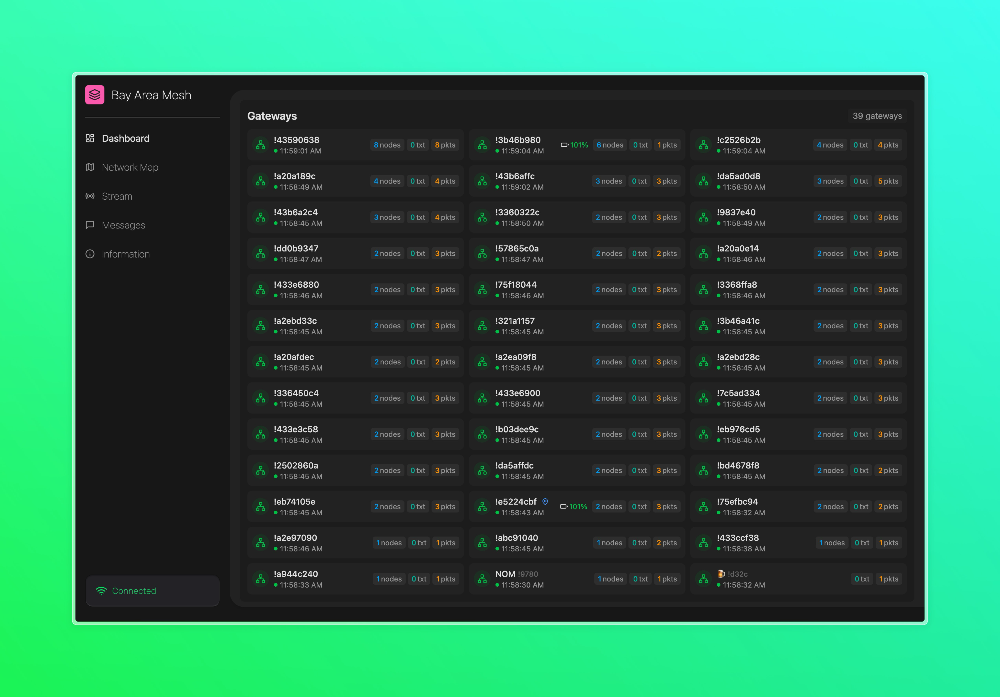
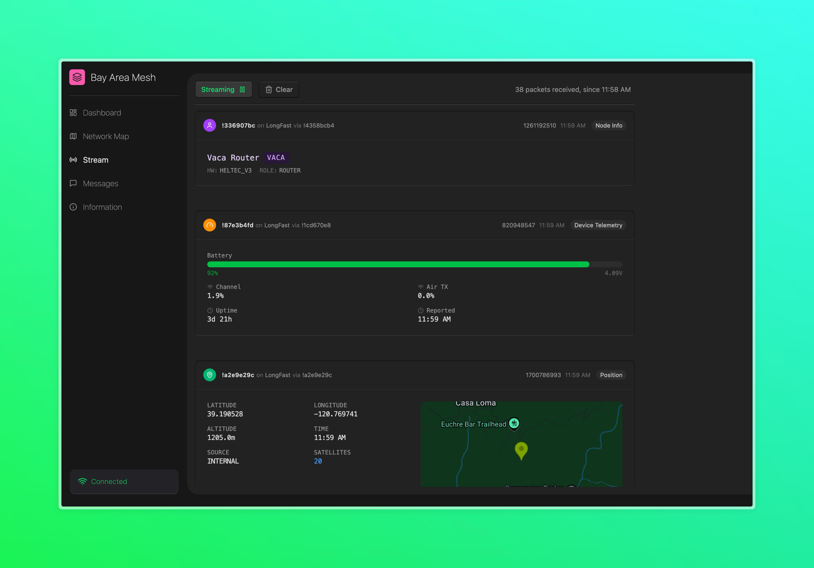

# Meshstream

Meshstream is a bridge between Meshtastic MQTT networks and web clients, enabling real-time monitoring and visualization of mesh network activity. The server component connects to Meshtastic MQTT servers, decodes mesh packets, and streams this data to web clients using Server Sent Events (SSE). The client-side application then aggregates and visualizes this raw data stream in various interactive views.

Meshstream caches recent network packets on the server side, but does not persist pemanently. Client will receive some historical data upon connection. This provides immediate context and visualization even before new real-time data starts flowing.



## Features

- **MQTT to SSE Bridge**: Connects Meshtastic MQTT networks to web clients using Server Sent Events
- **Real-time Map**: Interactive map showing node locations
- **Message Streaming**: Live view of all packets flowing reported on the MQTT topic
- **Telemetry Monitoring**: Track device metrics like battery levels, temperatures, and signal strength
- **Encrypted Channel Support**: Ability to decrypt private channels using pre-shared keys
- **Node Details**: In-depth information about each node in your network
- **Chat Activity**: View channels and text messages


## Quick Start

### Using Docker (Recommended)

The easiest way to get started:

```bash
# Clone the repository
git clone https://github.com/your-username/meshstream.git
cd meshstream

# Configure environment variables
cp .env.example .env

# Build and run with Docker Compose
docker-compose up
```

Then visit http://localhost:8080 in your browser.

### Manual Setup

Prerequisites:
- Go 1.24 or later
- Node.js 20 or later
- pnpm (for web UI development)

```bash
# Install dependencies and generate protobuf code
go mod tidy
make gen-proto

# Run the server
make run

# Run the client
make web-run
```

## Configuration

Meshstream can be configured through environment variables, command-line flags, or a `.env` file. All configuration options use the `MESHSTREAM_` prefix.

### Core Configuration

| Environment Variable | Default | Description |
|----------------------|---------|-------------|
| `MESHSTREAM_MQTT_BROKER` | mqtt.bayme.sh | MQTT broker address |
| `MESHSTREAM_MQTT_USERNAME` | meshdev | MQTT username |
| `MESHSTREAM_MQTT_PASSWORD` | large4cats | MQTT password |
| `MESHSTREAM_MQTT_TOPIC_PREFIX` | msh/US/bayarea | MQTT topic prefix for Meshtastic |
| `MESHSTREAM_SERVER_HOST` | localhost | Host to bind the web server |
| `MESHSTREAM_SERVER_PORT` | 8080 | Port for the web server |
| `MESHSTREAM_CACHE_SIZE` | 1000 | Number of packets to cache for new client connections |
| `MESHSTREAM_STATS_INTERVAL` | 30s | Interval for statistics reporting |
| `MESHSTREAM_CHANNEL_KEYS` | LongFast:DefaultKey,... | Comma-separated list of channel:key pairs for decrypting private channels |

> [!NOTE] 
> Meshstream can be configured with pre-shared keys to decrypt private encrypted channels. This should only be done when channel participants have explicitly consented to having their messages monitored or when Meshstream is deployed behind an authentication gateway. Remember that decrypting private channels without consent may violate privacy expectations and potentially laws depending on your jurisdiction.

### Web UI Configuration (Build-time)

These must be set at build time (via Docker build args):

| Build Variable | Description |
|----------------|-------------|
| `MESHSTREAM_GOOGLE_MAPS_API_KEY` | Google Maps API key for map visualization |
| `MESHSTREAM_GOOGLE_MAPS_ID` | Google Maps map ID |
| `MESHSTREAM_SITE_TITLE` | Custom site title |
| `MESHSTREAM_SITE_DESCRIPTION` | Custom site description |

For complete configuration options, see the Dockerfile and docker-compose.yml.




## License

[MIT License](./LICENSE)